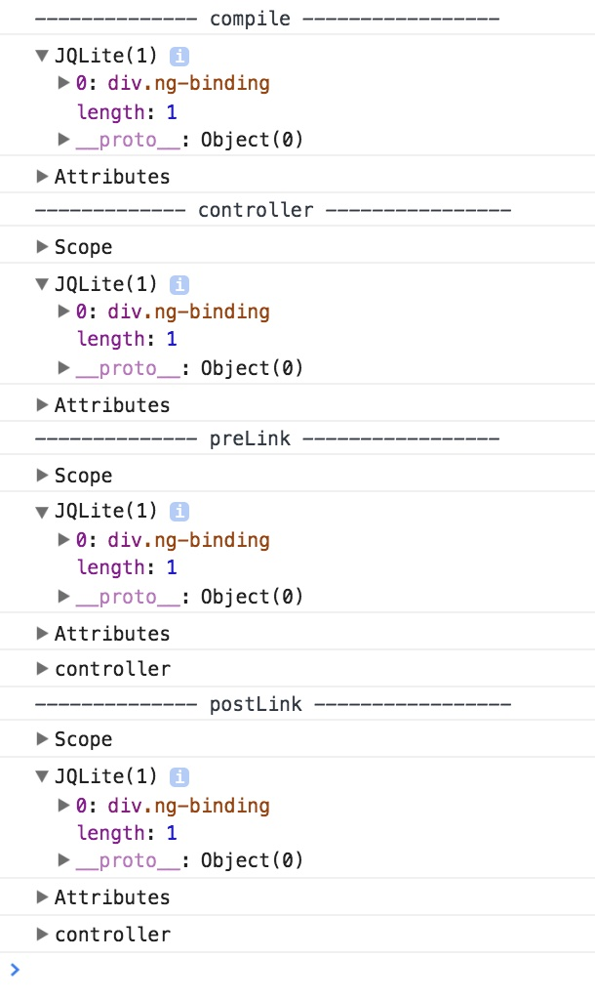
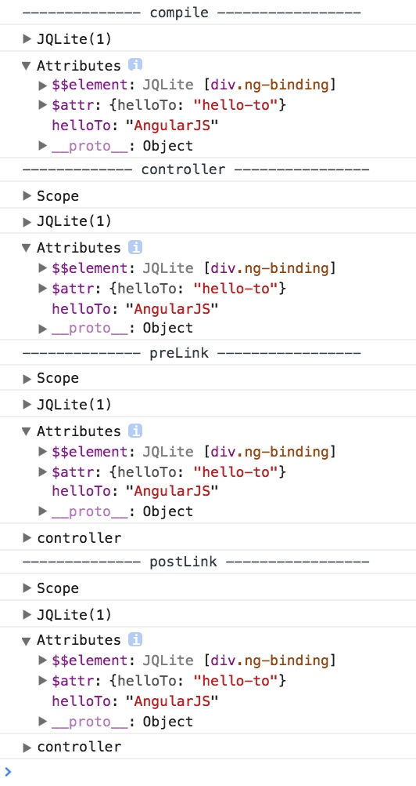

AngularJS1 Directive Compile Controller Param Types Demo
========================================================

For a directive in [AngularJS1](https://angularjs.org/),

```
compile: function (tElement, tAttrs)
controller: function ($scope, $element, $attrs)
```

What's the types of the params? Are the same types with different names (e.g. `tElement/$element`)?

Run:

```
npm install
open index.html
```

`xElement`:



We can see `tElement/iElement/$element` are same object.



`tAttrs/iAttrs/$attrs` are same object.

Resources
---------

- directive api: https://docs.angularjs.org/api/ng/service/$compile#directive-definition-object
- $element api: https://docs.angularjs.org/api/ng/function/angular.element#angularjs-s-jqlite